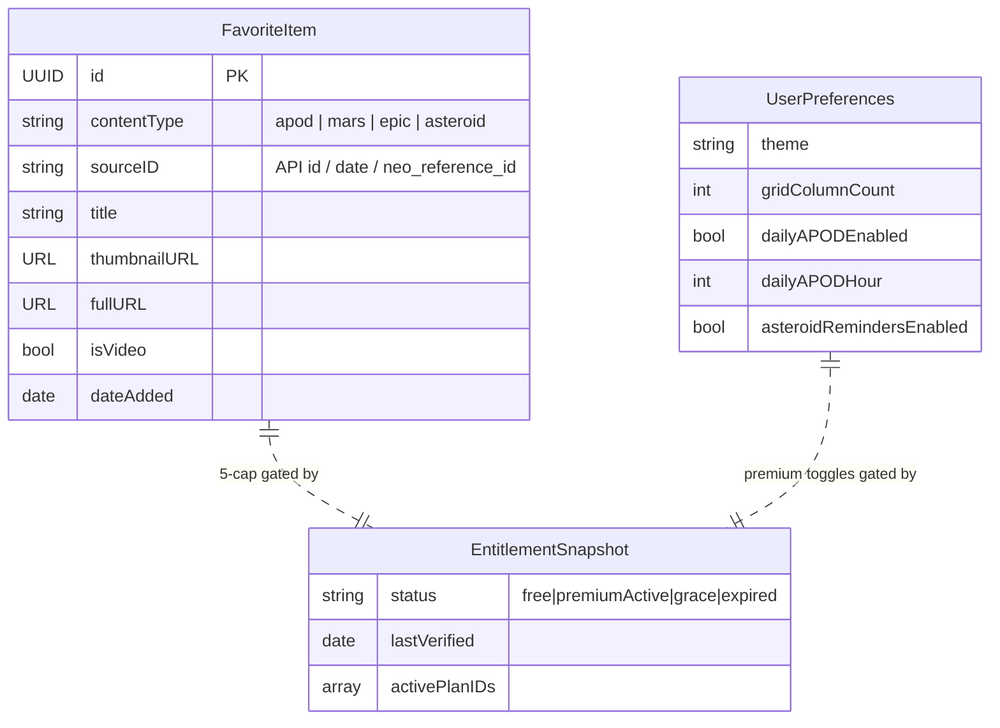

# ✨ Spacer — NASA explorer & Purchasely SDK showcase

> **Scope change (2026-06-16):** The **Mars** and **Asteroids** sections were removed
> to focus the app on the **daily space picture and its story** (APOD). Live tabs are
> now **Today · Explore · Profile**. The Mars/NeoWs services, views, models, the
> `marsAdvanced` / `asteroidsExtended` / `asteroidNotif` gates, and the `.mars` /
> `.asteroid` favourite types were deleted. References below to Mars/Asteroids are
> retained for historical context but are no longer in scope.

## Overview

A premium, **dark-mode-first iOS (SwiftUI) app** that opens a daily "window into the
universe" using NASA's free public APIs (APOD, Mars Rover Photos, NeoWs asteroids,
EPIC Earth imagery). Its flagship purpose is to be a realistic, beautiful showcase
of the **Purchasely SDK** — simultaneously (1) a sales/marketing demo, (2) a clean
developer **reference integration**, and (3) a shippable App Store product.

Architecture is **pure client-side**: NASA's free API called directly, Purchasely
for monetization, and on-device **local notifications** for engagement. No backend,
no server-side push.

The repo is currently a stock Xcode SwiftData template (`Item` / `ContentView` /
`SpacerApp` with the boilerplate list). Phase 0 replaces that scaffold entirely.

**Build order (from brainstorm):** NASA content + design system to a polished bar
*first*, then layer Purchasely onboarding + paywalls on top, with the entitlement
matrix defined up front so every content surface is built **gate-aware** from day one.

## Problem Statement / Motivation

Purchasely needs a flagship reference app that demonstrates the SDK in a *real,
beautiful, shippable* product rather than a toy. Existing demos read as contrived.
By building a genuinely desirable astronomy app and gating it with **hard paywalls**
that each double as a live-demoable Purchasely trigger, we get three artifacts at
once: a sales asset, copy-pasteable reference code, and an App Store product.

The hard part isn't any single API — it's the **monetization correctness**: a clean
entitlement state machine, paywalls that resume the user's original action on
purchase, graceful downgrade/refund re-locking, and A/B-ready placement-based
presentation. That is exactly the surface this plan front-loads as risk.

## Proposed Solution

A 5-tab SwiftUI app (iPhone-only for v1):

| Tab | Content | NASA API |
|---|---|---|
| **Today** | Astronomy Picture of the Day + explanation | APOD |
| **Explore** | Curated feed + **EPIC Earth imagery** (lives *inside* Explore — confirmed, not its own tab) | APOD range + EPIC |
| **Mars** | Rover photos browser | Mars Rover Photos |
| **Asteroids** | Near-Earth close approaches | NeoWs |
| **Profile** | Subscription status, favorites, settings, notification toggles, legal | — |

Monetization via **hard gates**, each a live Purchasely paywall trigger (see
Entitlement Matrix). Premium adds local notifications (daily APOD + asteroid
close-approach reminders) — the "needed a server" features satisfied on-device.

### Entitlement Matrix (single premium tier, monthly + yearly SKUs)

| Feature | Free | Premium |
|---|---|---|
| APOD (Today) | Today + last 7 days | Full archive back to 1995-06-16 |
| Favorites | **5 max (total, across all content types)** | Unlimited |
| Image quality | Standard | HD view + download to Photos |
| Mars Rover | 1 rover (Curiosity), latest photos only | All 4 rovers, any sol/date |
| Explore feed | Browse, limited depth | Full + Collections |
| Asteroids (NeoWs) | Next 7 days, basic fields | Extended window + full size/orbit detail |
| Daily APOD notification | — | ✅ on-device |
| Asteroid close-approach reminder | — | ✅ on-device |

**8 paywall triggers to demo:** favorite #6 · APOD older than 7 days · Mars
date/sol beyond limit *or* rover #2–4 · HD view/download · "see more" asteroids ·
Explore depth/Collections · daily-APOD toggle · asteroid-reminder toggle.

**Paywall UX contract (uniform across all 8 triggers):** on `.purchased`/`.restored`
the original gated action **auto-completes** (e.g. the 6th favorite is saved, the HD
download starts, the archive date applies); on `.cancelled` the action is **abandoned**
and prior state is restored; offline, a gated tap surfaces "connection needed" rather
than an empty paywall (Purchasely needs the network to fetch a presentation).

---

## Technical Approach

### Tech stack (locked)

| Layer | Choice |
|---|---|
| Language / UI | Swift 6 (strict concurrency) + SwiftUI |
| Min target | iOS 17 (Observation, SwiftData, modern animations) |
| Architecture | MVVM with `@Observable` (`@MainActor` view models) + async/await |
| Networking | `URLSession` + `Codable`, generic `APIClient`, retry/backoff for 429 |
| Image loading | Custom `ImageLoader` actor (bounded NSCache + capped LRU disk) + `CachedAsyncImage`; ImageIO downsampling at **two** target sizes. ⚠️ See Deepened Details — hardened with cache caps + off-actor decode; simplicity reviewer's dissent (start with `URLCache`) recorded there. |
| Persistence | SwiftData (`@Model` favorites, **main-context writes on `@MainActor`** — not `@ModelActor`) + `@AppStorage` (preferences) |
| Monetization | Purchasely iOS SDK via SPM (**only** third-party dep) |
| Notifications | `UserNotifications` (local only) |
| Secrets | `.xcconfig` → Info.plist → typed `Secrets` enum (gitignored) |

### Module / file layout

```
Spacer/
├── App/
│   ├── SpacerApp.swift             # @main, .preferredColorScheme(.dark), DI root, Purchasely.start
│   ├── RootTabView.swift           # 5-tab TabView
│   └── AppEnvironment.swift        # hand-written EnvironmentKey/EnvironmentValues (NOT @Entry — that's iOS 18; target is iOS 17)
├── DesignSystem/
│   ├── AppColor.swift  AppFont.swift  Spacing.swift   # tokens
│   ├── Components/ (PrimaryButtonStyle, CardModifier, EmptyStateView, ErrorStateView, StaleBanner)
│   └── Assets.xcassets (Color Sets — Dark variant authored first)
├── Networking/
│   ├── APIClient.swift  Endpoint.swift  APIError.swift  MockURLProtocol.swift
├── ImageCache/
│   ├── ImageLoader.swift           # actor, two-tier, dedup, downsample, prefetch
│   └── CachedAsyncImage.swift
├── NASA/
│   ├── APOD/ (APOD.swift, APODEndpoint.swift, APODService.swift, TodayView.swift, TodayViewModel.swift)
│   ├── Mars/ (MarsPhoto.swift, MarsManifest.swift, MarsEndpoint.swift, MarsService.swift, Mars*View(Model).swift)
│   ├── Asteroids/ (NeoFeed.swift, NearEarthObject.swift, NeoEndpoint.swift, NeoService.swift, Asteroid*View(Model).swift)
│   ├── EPIC/ (EPICImage.swift, EPICEndpoint.swift, EPICService.swift)  # surfaced in Explore
│   └── Explore/ (ExploreView.swift, ExploreViewModel.swift)
├── Favorites/
│   ├── FavoriteItem.swift          # @Model — @Attribute(.unique) dedupKey = "contentType#sourceID"
│   ├── FavoritesStore.swift        # main-context CRUD on @MainActor; atomic count-then-insert (cap)
│   └── FavoritesView.swift / FavoritesViewModel.swift
├── Monetization/
│   ├── PurchaselyService.swift     # @MainActor wrapper (protocol + impl); owns event delegate → EntitlementProvider.apply()
│   ├── EntitlementProvider.swift   # state machine + capability accessors; EntitlementSnapshot mirror PRIVATE to this type
│   ├── Paywall.swift               # Placement enum + UIViewControllerRepresentable bridge (owns dismissal)
│   └── FeatureGate.swift           # typed enum + GatedAction{perform/rollback}; one attempt(gate:) call path
├── Notifications/
│   └── NotificationService.swift   # daily APOD + asteroid reminders, priming UX
├── Profile/
│   └── ProfileView.swift (subscription status, manage, restore, toggles, Terms/Privacy)
└── Config/
    ├── Secrets.swift  Secrets.example.xcconfig (committed)  Secrets.xcconfig (gitignored)
```

### Data model — ERD



`FavoriteItem` is the only SwiftData `@Model` (favorites are heterogeneous — APOD /
Mars / EPIC / asteroid — distinguished by `contentType`). `EntitlementSnapshot` is a
lightweight local mirror persisted in `UserDefaults` (fast-path / offline hint only).
`UserPreferences` is `@AppStorage`.

### Codable models — NASA gotchas to encode now

- **APOD** (`/planetary/apod`): `hdurl` and `copyright` are **optional** (`String?`);
  `media_type` can be `"image"` or `"video"` (video `url` is a YouTube/Vimeo embed,
  has no `hdurl`). Date format is `YYYY-MM-DD` → needs a **custom date strategy**
  (not `.iso8601`). Archive floor **1995-06-16**.
- **Mars** (`/mars-photos/api/v1`): query by `sol` *or* `earth_date`; never hardcode
  max sol — read it from `/manifests/{rover}` (`max_sol`). Spirit/Opportunity are
  historical-only (handle "no photos for date" as an empty state, not an error).
- **NeoWs** (`/neo/rest/v1/feed`): `feed` is **max 7-day span**; `near_earth_objects`
  is a **dict keyed by date string**. ⚠️ velocity / miss-distance / diameter numeric
  values arrive as **JSON strings** — decode as `String`, convert in the model.
  Premium "extended window" = loop multiple ≤7-day requests (rate-limit aware).
- **EPIC** (`/EPIC/api`): the `image` field has **no extension**; build the archive
  URL from the timestamp: `…/EPIC/archive/natural/YYYY/MM/DD/png/{image}.png?api_key=`.
  Imagery lags 1–2 days; pick a representative image per day.

### Entitlement state machine (`EntitlementProvider`)

The whole UI reads gating from **one** `@MainActor @Observable EntitlementProvider`,
never from Purchasely directly. States and transitions:

```
free → premiumActive          (purchase / restore succeeds)
premiumActive → grace         (Apple billing-retry — KEEP premium unlocked)
grace → premiumActive         (billing recovers)
grace → expired               (grace ends)
premiumActive → expired       (cancel at period end / refund / revocation)
expired → premiumActive       (re-subscribe / restore)
```

**Re-lock rules on losing premium** (expired): premium notifications are **cancelled**;
both toggles flip OFF (reflecting true state); over-cap favorites are kept
**visible but read-only** (no destructive prune); archive/HD/extra-rovers re-gate.
`synchronize()` runs on foreground (`scenePhase → .active`) then re-reads
`userSubscriptions`; the local `EntitlementSnapshot` is the offline fast-path, the
SDK + StoreKit are authoritative.

### Purchasely integration shape (grounded in local `purchasely-integrate` skill)

- **Init** in `SpacerApp.init()`: `Purchasely.start(withAPIKey:appUserId:nil,
  runningMode:.full, paywallActionsInterceptor:nil, storekitSettings:.storeKit2,
  logLevel:.debug)`; set the actions interceptor + event delegate right after a
  successful start. `[verify]` exact `storekitSettings` type + current SDK version
  (skill cited ~5.7.5 — confirm latest tag, pin **Exact Version**).
- **Present by placement, never by presentation id** (this is what makes the app
  A/B-ready): `try await Purchasely.fetchPresentation(for: placement)` → `switch`
  on `PLYPresentationType` (`.normal`/`.fallback` → `display(controller:)`,
  `.deactivated` → nothing, `.client` → our native paywall). Bridge to SwiftUI via a
  `@MainActor PurchaselyService` that presents on the scene's top view controller.
  Placements: `onboarding`, `favorites`, `apod_archive`, `hd`, `mars`, `asteroids`,
  `explore`, `notifications`.
- **Action interceptor**: every branch **MUST call `proceed(...)`** or the paywall
  freezes. Wire `.purchase`/`.restore` (Full mode → `proceed(true)` lets the SDK run
  it), `.navigate` (open URL), `.close`.
- **Restore** (`restoreAllProducts`) + **Manage subscription**
  (`AppStore.showManageSubscriptions(in:)` on iOS 17+) live in Profile.
- **A/B readiness**: placements only + `setUserAttribute(...)` seed targeting
  attributes (country, has-favorited, days-since-install) so the targeting/A-B demo
  is actually demonstrable.
- **Swift 6**: SDK is ObjC-interop, likely not fully `Sendable`-annotated. Confine
  **all** SDK calls to the `@MainActor PurchaselyService`; bridge completion handlers
  to async via `withCheckedThrowingContinuation`. `[verify]` Sendable posture.

### Implementation Phases

#### Phase 0 — Foundation & scaffolding
- [ ] Delete template (`Item.swift`, list `ContentView`); replace with `RootTabView` (5 tabs) + `.preferredColorScheme(.dark)`.
- [ ] Secrets pipeline: `Secrets.xcconfig` (gitignored) + `Secrets.example.xcconfig` (committed) + `Secrets.swift`; add `NASA_API_KEY` to `.gitignore`. **Use a personal NASA key (provided) — not DEMO_KEY** — for the higher rate limit; DEMO_KEY as documented fallback. xcconfig gotcha: `//` is a comment, store host without scheme.
- [ ] `Networking/`: `APIClient` (Sendable struct), `Endpoint`, `APIError` (incl. `.rateLimited(retryAfter:)`), retry/backoff honoring `Retry-After`, `MockURLProtocol`.
- [ ] `ImageCache/`: `ImageLoader` actor (memory NSCache + disk, in-flight dedup, ImageIO downsample, prefetch, memory-warning clear) + `CachedAsyncImage`.
- [ ] `DesignSystem/`: color tokens (Color Sets, Dark variant first), `AppFont`, `Spacing`/`Radius`, `PrimaryButtonStyle`, `CardModifier`, `EmptyStateView`, `ErrorStateView`, `StaleBanner`.
- **Deliverable:** app launches to 5 empty dark-themed tabs; networking + image cache unit-tested with `MockURLProtocol`.

#### Phase 1 — NASA content & design system (built gate-aware, all unlocked)
> `EntitlementProvider` exists as a stub returning `free`; feature flags are read everywhere, but no paywall is wired yet, so the team can build and QA content freely.
- [ ] **Today/APOD**: `APODService` + `TodayViewModel`; render image/title/date/explanation; **handle `media_type == video`** (play/open-in-browser, hide HD); favorite button; per-date cache (immutable → 1 req/day).
- [ ] **Mars**: manifest fetch (`max_sol`), rover picker, sol/earth_date picker, camera filter, paginated grid via `CachedAsyncImage`; empty-state for no-photos-for-date; inactive-rover handling.
- [ ] **Asteroids**: NeoWs `feed` (≤7-day), string→number conversion, hazardous flag, diameter/velocity/miss-distance display; empty-window state.
- [ ] **Explore + EPIC**: APOD-range feed + EPIC natural imagery (URL built from timestamp); Collections section (gate-aware).
- [ ] **Favorites**: `FavoriteItem` `@Model`, `FavoritesStore` `@ModelActor`, heterogeneous list, 5-cap enforced via `EntitlementProvider` (no paywall yet — just blocks at 5).
- [ ] **Cross-cutting**: offline → favorites + last-viewed cache served from disk with `StaleBanner`; 429 → backoff + cached fallback + distinct "rate limited" copy; date-window anchored to **NASA US/Eastern** publication clock (documented; device-clock spoof acknowledged as out-of-scope for a demo).
- **Deliverable:** all four NASA experiences polished, favoritable, offline-resilient — no monetization yet.

> **Phase order revised (2026-06-16):** Phase 2 and Phase 3 were swapped — **polish
> first, monetization last**. Phase 3 (Purchasely) will be driven by the installed
> **`purchasely-integrate`** skill rather than hand-spec'd here. Premium notifications
> moved into Phase 3 since they're gated by Purchasely.

#### Phase 2 — Polish & experience (design language, no monetization)
- [x] "Focusing the telescope" hero reveal on Today (blur→sharp, title rises); slow Ken-Burns drift (gated on Reduce Motion).
- [x] `.symbolEffect` micro-animations (favorite bounce); `.variableColor` scanning loaders (`ScanningLoader`).
- [x] Hero→detail transition: `matchedTransitionSource` + `.navigationTransition(.zoom)` on iOS 18 (Explore → APOD/EPIC detail), no-op on iOS 17 (`ZoomTransition` helper).
- [x] Design-language pass: film-grain overlay (`GrainOverlay`), `HeroScrim`, refined skeleton/loading states ("ACQUIRING…/SCANNING…" instrument readouts).
- [x] Accessibility: Dynamic Type (text styles), VoiceOver labels on images + button traits on tappable tiles, Reduce Motion (shimmer/hero/Ken-Burns) and Reduce Transparency (grain off; materials adapt natively).
- [x] Empty/error states audited on every surface (Today, Explore, EPIC detail, Favorites).
- **Deliverable:** the app feels polished and distinctive end-to-end, still fully usable on the free tier (no paywalls yet). _(Code complete; awaiting a build to verify.)_

#### Phase 3 — Purchasely monetization + premium notifications (**use the `purchasely-integrate` skill**)
> Drive the SDK integration with the installed **`purchasely-integrate`** skill (authoritative for init, paywall display, action interceptor, restore/manage). The skill defines the *how*; the items below are the app-specific *what*.
- [ ] Add Purchasely via SPM (Exact Version); IAP capability; `.storekit` config (monthly + yearly, **7-day trial on yearly only**).
- [ ] `PurchaselyService` (`@MainActor` wrapper) + `Purchasely.start` in `SpacerApp.init` — per the skill.
- [ ] **Real `EntitlementProvider`**: state machine (free→premiumActive→grace→expired), `userSubscriptions`, `synchronize()` on foreground, local `EntitlementSnapshot`, **grace keeps premium**, downgrade re-lock.
- [ ] Action interceptor (all branches call `proceed`) + event delegate.
- [ ] **Onboarding paywall** + swap `NoOpPaywallPresenter` → real presenter so the **5 already-wired gates** fire real paywalls (favorites · apod_archive · hd · explore · dailyNotif), honoring the resume-on-purchase contract; offline → "connection needed".
- [ ] Profile: subscription status, **Restore**, **Manage subscription**, **Terms + Privacy** links.
- [ ] **Premium notifications**: `NotificationService` with permission priming + **daily APOD reminder** (`UNCalendarNotificationTrigger`); premium-gated toggle; cancel on downgrade; deep-link → today's picture (re-gate if downgraded).
- [ ] A/B readiness: placements only + seeded `setUserAttribute` attributes.
- **Deliverable:** shippable v1 — every gate triggers a real paywall; purchase/restore/cancel/downgrade correct; sandbox-tested.

---

## Alternative Approaches Considered

- **Thin caching proxy / serverless for the NASA key** — would fix the shared-key
  rate-limit ceiling at scale, but **violates the "no backend" decision** and the
  zero-ops/clone-as-reference goal. Rejected for v1; documented as the scale path.
- **Soft metering instead of hard gates** — rejected in the brainstorm: hard walls
  produce cleaner, repeatable paywall moments that demo and read as reference better.
- **`ObservableObject` + Combine** — rejected for `@Observable` (per-property
  invalidation, less boilerplate, the iOS-17 idiom).
- **Third-party image library (Kingfisher/Nuke)** — rejected; the custom cache is a
  deliberate native-caching showcase and keeps deps to *only* Purchasely.
- **Universal (iPad) from day one** — deferred (user decision: iPhone-only v1).

## Acceptance Criteria

### Functional
- [ ] **APOD load**: today's image/title/date/explanation render online; HD button visible-but-gated for free users.
- [ ] **APOD video**: when `media_type == video`, a playable/openable embed shows (not a broken image); HD/download hidden.
- [ ] **429 handling**: cached content + stale banner + distinct "rate limited" message; never a blank crash.
- [ ] **Free archive wall**: free user selecting APOD older than 7 days (NASA-ET anchored) → paywall; date applies only on purchase.
- [ ] **Favorite cap**: at 5 favorites, the 6th → paywall; on dismiss count stays 5; on purchase the 6th auto-saves.
- [ ] **Purchase resume**: all 8 triggers complete the original action on `.purchased` without re-tap.
- [ ] **Purchase cancel**: no entitlement granted; gated action not performed.
- [ ] **Restore**: active prior sub → premium unlocks; none → clear non-error "nothing to restore".
- [ ] **Downgrade re-lock**: on expiry/refund, premium features re-gate, premium notifications cancelled, toggles OFF, over-cap favorites visible read-only.
- [ ] **Grace period**: premium stays unlocked during Apple billing-retry.
- [ ] **Notification permission**: priming → system prompt; denied → Settings deep-link; toggle reflects true state.
- [ ] **Notification deep-link**: routes to content cold/background/foreground; gated-after-downgrade → paywall.
- [ ] **Mars empty result**: zero-photo date → empty state with suggested alternative (not an error).
- [ ] **Mars gating**: free user picking rover #2–4 or non-latest date → paywall; selection reverts on dismiss.
- [ ] **Asteroid empty window**: distinct empty state.
- [ ] **Offline**: last-cached content per tab + offline indicator; gated tap → "connection needed".
- [ ] **Paywall legal**: Terms, Privacy, Restore reachable on every paywall.

### Non-Functional
- [ ] Swift 6 strict-concurrency clean (no data-race diagnostics); SDK calls confined to `@MainActor PurchaselyService`.
- [ ] Large NASA images downsampled (no memory blowups); scroll feeds prefetch.
- [ ] Dark-mode-first; Dynamic Type, VoiceOver, reduced-motion supported.
- [ ] NASA key absent from git history; secrets via gitignored `.xcconfig`.

### Quality Gates
- [ ] Unit tests: `APIClient` (success/429/retry/decoding) via `MockURLProtocol`; NeoWs string→number; EPIC URL builder; `EntitlementProvider` state machine.
- [ ] Sandbox: full purchase, restore, cancel, downgrade verified with a sandbox Apple ID + `.storekit` config.
- [ ] No `print`-only error handling on user paths; every failure has a UI state.

## Success Metrics

- **Demo**: every one of the 8 paywall triggers reachable in < 30s of live tapping.
- **Reference**: each Purchasely surface (onboarding, feature paywall, restore,
  manage, promo offer, placement/A-B, targeting) maps to a single, readable file.
- **Product**: passes App Store subscription review (Terms/Privacy/Restore present,
  no broken states), cold-launch to Today content fast and offline-resilient.

## Dependencies & Prerequisites

- **Purchasely Console** project with: app, products (monthly + yearly), **7-day
  intro offer on yearly**, entitlement, and the 8 placements above with paywalls.
- App Store Connect: app record, subscription group, sandbox Apple ID.
- NASA personal API key: referenced as `<NASA_API_KEY>` placeholder — the real value
  goes **only** into the gitignored `Secrets.xcconfig`, **never** committed.
  ⚠️ The original key was shared in chat in plaintext and is **burned** — **rotate it
  now at api.nasa.gov** (before Phase 0, not "before release" — a deferred rotation
  never happens). Low-sensitivity key (worst case = rate-limit exhaustion).
- `NSPhotoLibraryAddUsageDescription` (HD download to Photos).
- Xcode 16+ (Swift 6, Swift Testing); iOS 17 deployment target.

## Risk Analysis & Mitigation

| Risk | Severity | Mitigation |
|---|---|---|
| **Shared bundled NASA key → 429 is the steady state, not a tail risk** (perf review: ~50–150 metered calls per engaged session; ~7–20 concurrent users exhausts a 1,000/hr key — the app *will* 429 under normal multi-user load) | **High → reframed** | Biggest win: **strip `api_key` from image-byte URLs** where the archive host (`apod.nasa.gov`/`epic.gsfc.nasa.gov`) doesn't meter it — classify metered (JSON) vs image hosts on first run. Per-date APOD cache, `URLCache`+capped disk, client-side **token-bucket limiter (~12 req/min)** that self-throttles *before* NASA, a **global 429 cooldown gate** on first 429, backoff honoring `Retry-After`. **Honest statement: sufficient for the demo/single-reviewer case only; a thin caching proxy is *required* for real App Store scale.** DEMO_KEY (30/hr) is smoke-test only. |
| **Purchasely SDK API drift** | Low (mostly resolved) | `purchasely-review` skill **confirmed**: SDK **5.7.5** exact-pin, `storekitSettings: .storeKit2`, `PLYPresentationType` (`.normal/.fallback/.deactivated/.client`), result (`.purchased/.restored/.cancelled` + `@unknown default`), `userSubscriptions` (no "entitlements" API), `restoreAllProducts`, `AppStore.showManageSubscriptions(in:)`. **Still open:** iOS `.purchase`/`.restore` action-enum spellings + Swift 6 `Sendable` posture → verify against `references/ios/api-reference.md` / docs.purchasely.com before Phase 2. |
| **Campaigns/deeplinks unconfigured → trigger paywalls silently never display** (undercuts the A/B/targeting demo) | Medium | Set `Purchasely.readyToOpenDeeplink = true` *after* root VC init (not in start callback); `setDefaultPresentationResultHandler`; `handleDeeplink()`. |
| **Swift 6 strict concurrency vs ObjC-interop SDK** | Medium | Confine all SDK calls to `@MainActor PurchaselyService`; bridge completions to async; treat presentation/close as main-actor work. |
| **APOD-is-video / heterogeneous favorites** | Medium | `isVideo` flag on `FavoriteItem`; defined fallbacks for HD/download on video; `contentType` discriminator. |
| **Entitlement desync** (refund/grace/permission-revoked-in-Settings) | Medium | One `EntitlementProvider` source of truth; `synchronize()` on foreground; refresh notification status on `.active`; explicit re-lock rules. |
| **Premium notification fires after lapse** | Low | Cancel scheduled premium notifications on downgrade; deep-link target re-checks gating and shows paywall if needed. |
| **Leaked NASA key in chat/history** | Low (low-sensitivity key) | **Rotate NOW** (key is burned — see redaction above), not "before release." Only worst case is rate-limit exhaustion. |
| **App Store privacy/compliance rejection** (security review) | Medium | Root `PrivacyInfo.xcprivacy` (required-reason APIs: UserDefaults `CA92.1`, FileTimestamp `C617.1`, DiskSpace if used) reconciled with Purchasely's bundled manifest; **lock "no tracking"** (no ATT/IDFA, App Store "Data Used to Track You" = none); paywall must carry Terms+Privacy+Restore + price/term/auto-renew text (Apple 3.1.2c/4.9); Photos **add-only** auth for HD download. |

## Open Questions — resolved in this plan

| Brainstorm question | Resolution |
|---|---|
| Entitlement persistence (local mirror vs Purchasely-only) | **Both**: Purchasely + StoreKit authoritative; local `EntitlementSnapshot` as offline fast-path hint. |
| NASA key bundling / rate limits | Bundle via gitignored `.xcconfig` (personal key); accept extractable risk (low-sensitivity); aggressive caching; proxy = future scale path. |
| EPIC tab placement | **Inside Explore** (5 tabs confirmed). |
| Offline scope | **Favorites + last-viewed image cache** (user decision). |
| Free trial mechanics | **7-day trial on yearly only** (user decision). |
| iPad layout | **iPhone-only v1**; universal deferred (user decision). |
| Favorites cap semantics | **5 total** across all content types (simpler, cleaner demo). |
| Date-window clock | Anchored to **NASA US/Eastern** publication; device-clock spoof out-of-scope for demo. |

## References & Research

### Internal
- Brainstorm: `docs/brainstorms/2026-06-16-spacer-brainstorm.md`
- Local skills: `purchasely-integrate` (authoritative SDK reference), `purchasely-review`, `purchasely-debug`
- Current template to replace: `Spacer/SpacerApp.swift`, `Spacer/ContentView.swift`, `Spacer/Item.swift`

### External (verify exact current signatures before shipping)
- NASA APIs: https://api.nasa.gov (APOD, Mars Rover Photos, NeoWs, EPIC) — key via `?api_key=`; rate-limit numbers + per-rover `max_sol` to confirm on first run.
- Purchasely iOS: https://docs.purchasely.com · https://github.com/Purchasely/Purchasely-iOS — `[verify]` SDK version (~5.7.5), `storekitSettings`, `PLYPresentationType`/result/action enums, entitlements API, Swift 6 Sendable posture.
- Apple: Observation framework, SwiftData (`@Model`/`@Query`/`@ModelActor`), `URLSession` async, `NSCache`, `CGImageSourceCreateThumbnailAtIndex`, `UserNotifications`, xcconfig, HIG Dark Mode, `phaseAnimator`/`symbolEffect`/`matchedTransitionSource`.

> AI-era note: this plan was assembled by Claude from four parallel research agents
> (NASA APIs, Purchasely SDK, Swift 6/SwiftUI architecture, spec-flow analysis) and
> then deepened by eight more (security, architecture, performance, simplicity,
> data-integrity, paywall-UX, frontend-design, Purchasely production-readiness).
> Given rapid implementation, treat the remaining `[verify]` Purchasely items and the
> NASA rate-limit numbers as the human-review checkpoints, and lean on the
> unit/sandbox quality gates above.

---

# 🔬 Deepen Enhancement (research pass — 2026-06-16)

**Deepened by 8 parallel agents.** The plan's *core* was validated as strong and is
unchanged: single `@MainActor EntitlementProvider`, present-by-placement,
interceptor-always-`proceed()`, resume-on-purchase contract, and the gate-aware
build order. Enhancements below refine the *supporting* layers.

### Key improvements
1. **Typed `FeatureGate` + `GatedAction`** replaces a bare `gate(action:)` closure.
2. **Capability accessors** on `EntitlementProvider`; UI never branches on raw `status`.
3. **Image pipeline hardened** with concrete caps + off-actor decode (perf numbers below).
4. **NASA 429 reframed** from tail-risk to steady-state, with self-throttling mitigations.
5. **Favorites integrity**: unique `dedupKey`, atomic cap, derived (not stored) over-cap.
6. **Purchasely gaps closed**: deeplink/campaign readiness, preload, `#if DEBUG` logs, event delegate, `PrivacyInfo.xcprivacy`.
7. **Design language**: a committed "Observatory at night" aesthetic (amber accent).
8. **`@Entry` → hand-written `EnvironmentKey`** (iOS 17 reality).

### Conflicts surfaced (recorded, with chosen resolution)
- **Custom `ImageLoader` vs `AsyncImage`+`URLCache`** — *simplicity* said simplify;
  *architecture* + *brainstorm* said the custom layer is a deliberate showcase.
  **Resolution: KEEP the custom `ImageLoader`** — it's *required* anyway for
  favorites-pinning (offline durability), prefetch control, two-size downsampling, and
  `api_key` stripping, none of which `URLCache` does well — **but apply all perf
  hardening below.** If those needs were dropped, `URLCache`+downsample would suffice
  (simplicity's dissent noted).
- **`@ModelActor` vs main-context writes** — *simplicity* said main-context;
  *data-integrity* wanted atomicity; *performance* flagged `@ModelActor` footguns.
  **Resolution: main-context writes on `@MainActor`.** The `@MainActor` is itself
  serial, so a synchronous count-then-insert is *already atomic* (no TOCTOU) — this
  satisfies both reviewers and is simpler. Drop `@ModelActor` for v1.
- **Migration plan** — *simplicity* said cut; *data-integrity* said ship versioning.
  **Resolution: ship the `@Attribute(.unique) dedupKey` in the V1 schema** (prevents
  the dangerous "add-unique-later" migration), but **no `SchemaMigrationPlan`** until
  the first real schema change. Document the lightweight-vs-custom rule + a
  no-data-loss migration quality gate now.
- **8 placements vs ~3** — reconciled: keep **8 named Console placements** (cheap, each
  A/B-testable with bespoke contextual hero copy) but route them all through **one**
  `FeatureGate.attempt(gate:)` code path. Placements shine *because* one path serves
  many server-configured variants.

---

## Deepened Details by area

### Architecture (additions)
- **`FeatureGate`**: `enum FeatureGate { case favoriteOverCap, apodArchive, marsAdvanced, hdDownload, asteroidsExtended, exploreDepth, dailyNotif, asteroidNotif }`, each mapping 1:1 to a `Placement`. `GatedAction { perform() ; rollback() }` — deferred actions (save 6th favorite, start HD download) give a no-op `rollback`; state-selecting triggers (Mars rover/date, APOD archive date) give a real `rollback` so "revert on cancel" is type-enforced. One `attempt(_ gate:, perform:, rollback:)` method owns: offline pre-check → `fetchPresentation` → await result → `perform`/`rollback`. **Move the `FeatureGate` type + capability API into Phase 1** (with a no-op presenter) so Phase 2 is a one-line swap.
- **Capability accessors** on `EntitlementProvider`: `isUnlocked(_ feature:) -> Bool`, `favoriteCap: Int?`. Grace-keeps-premium and re-lock rules live *only* here.
- **Dependency rule** (state explicitly): NASA & Favorites layers **never import Monetization**; services return full data, gating/truncation happens in the VM/view layer reading `EntitlementProvider`.
- **Event-delegate push path**: `PurchaselyService` owns `PLYEventDelegate` and forwards async subscription changes (refund/grace/revocation from outside the app) to `EntitlementProvider.apply(subscriptions:)` on `@MainActor` — the plan previously had only foreground `synchronize()`.
- **Protocols for stubbing**: each `*Service` and `PurchaselyService` is a protocol + impl, so Phase 1 ships without linking the SDK and view models are unit-testable.

### Image pipeline & performance (concrete numbers)
- **Disk cache**: cap **200 MB**, LRU by access date (`contentAccessDateKey`), trim on launch + on writes crossing the cap; store under `Caches/`. *(Currently missing → guaranteed storage bug.)*
- **NSCache (memory)**: `countLimit ≈ 100`, `totalCostLimit ≈ 64 MB`, `cost = decodedBytes (W×H×4)` — not file size.
- **Two downsample targets**, cache key = `url + targetPixelSize`: grid ≈ `cellWidth × scale` (~360 px), detail ≈ `screenWidth × scale` (~1170 px), hard `maxPixelSize 2048` to survive 20 MP panoramas.
- **Decode OFF the actor's serial context** (`Task.detached`/dedicated queue) — keep only cache bookkeeping on the actor, or fast scroll collapses FPS. **Cancel in-flight loads on cell `.onDisappear`.**
- **Prefetch window**: 1.5 screens (~12–18 items), never deeper (deeper prefetch on a metered API multiplies 429s); cancel on leaving window. Mars page = 25; fetch next page ~6 items from end, debounced. **EPIC: one representative image/day** in the grid, full set only on detail.
- **Cold launch**: move `Purchasely.start` + APOD refresh **off** the critical path (start in a `Task` after first frame); render Today from disk cache then revalidate ("serve-stale-then-revalidate"); target **< 400 ms to first content** (new non-functional AC).

### Data model & favorites integrity
- **`FavoriteItem`**: add `dedupKey: String @Attribute(.unique)` = `"\(contentType)#\(sourceID)"` (set at init); UUID demoted to surrogate; inserts are **upsert-by-`dedupKey`**. Define `sourceID` per type: APOD=`date`, Mars=photo `id`, EPIC=`image` name, asteroid=`neo_reference_id`.
- **Persist URLs WITHOUT `api_key`** (append current key at load) so a key rotation doesn't 401 every saved favorite; EPIC stores timestamp + image-name parts.
- **Offline durability**: favoriting **pins** the image bytes against LRU eviction (or copies to a favorites dir); define the missing-bytes render ("image unavailable offline", not an infinite spinner). For asteroid/Mars, either scope offline to "thumbnail + title only" or add a `detailJSON: Data?` snapshot.
- **5-cap**: enforced as a synchronous `@MainActor` count-then-insert returning `.inserted / .rejectedCapReached / .alreadyExists`; caller passes `maxFavorites: Int?` from `EntitlementProvider`; UI count is display-only. New AC: *rapid/concurrent taps never persist more than the cap.*
- **Over-cap on downgrade**: canonical order `(dateAdded ASC, dedupKey ASC)`; first N (=cap) active, remainder **read-only via a pure derived function** — never a persisted `isLocked` flag (re-upgrade restores with zero mutation).

### Entitlement discipline (security + data-integrity)
- `EntitlementSnapshot` is a **single atomic Codable blob** in `UserDefaults`, **private to `EntitlementProvider`** — nothing else reads it. Written only *after* a successful authoritative read.
- **StoreKit 2 verified (Apple-signed JWS) transactions + `userSubscriptions` are truth**; the snapshot is an optimistic <1s render hint and a verified-offline hint only. Online success with no current entitlement ⇒ downgrade. **Never the sole gate.**
- **`grace`** is only entered/exited from an authoritative read — never self-originated/prolonged offline. If StoreKit is unreachable at grace-expiry, keep last authoritative state; re-lock on next sync.
- **Downgrade re-lock** is one ordered routine: flip toggles OFF → cancel pending premium notifications → persist snapshot=expired. Notification deep-link re-checks gating at open time.
- **Accepted limitation**: no-backend ⇒ a jailbroken user can flip local state; this is unpreventable without a server. **No jailbreak detection** (defeatable, adds review friction); StoreKit 2 on-device signature verification is the strongest available control. Document, don't pretend to prevent.

### Purchasely production-readiness (gaps to close in Phase 2)
- `logLevel: .debug` **behind `#if DEBUG`** (leaks placement/audience IDs in release).
- **Await `start` completion** before any `fetchPresentation`/`synchronize` (no fire-and-forget).
- **Deeplink/campaign readiness**: `readyToOpenDeeplink = true` after root VC init; `setDefaultPresentationResultHandler`; `handleDeeplink()`. *(Required for the Console-campaign / targeting demo.)*
- **Presentation preload**: prefetch `onboarding` + hottest gates at launch, hold for instant display, invalidate on foreground (also serves the "<30s to any trigger" demo metric).
- **Event delegate**: route `PLYEventDelegate` through one analytics/log sink; `[Spacer]` diagnostic markers around `synchronize`/dismiss/`fetchPresentation`.
- **`fetchPresentation` error mapping** for non-offline `PLYError` (invalid placement / server) → UI state, never silent.
- **`.client` path**: build one native fallback paywall *or* assert it never fires (Console never returns `.client`).
- **Anonymous-only**: state explicitly (no `userLogin`/`userLogout`). **7-day yearly trial = StoreKit intro offer, Full-mode auto-handled** — do *not* call promotional-offer APIs.
- **SwiftUI representable owns paywall dismissal** (`.close` + result paths) — verify no stuck-paywall state. Add `@unknown default` to the result switch and a `default → proceed(true)` interceptor branch.
- **`.navigate` URL whitelist** (https/known schemes only) in the interceptor.

### Paywall UX & App Store compliance (paywall-UX research)
- Onboarding: 3–5 **value-first** screens before any price; **reachable dismiss** affordance (a no-exit onboarding paywall is a common rejection + 1-star magnet); yearly+trial pre-selected & dominant; show a **free-trial timeline** graphic.
- **Mandatory on every paywall** (Apple 3.1.2c + 4.9 + 3.1.1): what you get · renewal term + "until canceled" · actual price billed · how to cancel · functional **Terms (EULA) + Privacy + Restore** links. Build into the Purchasely Screen template so all placements inherit it. Read the intro-offer string from SDK plan data (don't hardcode "7 days free" — varies by storefront).
- **Day-5 trial reminder** fired off real Purchasely subscription dates (not a hardcoded timer), framed as value-loss.
- **A/B/targeting attributes to seed** (`setUserAttribute`): `onboarding_completed`, `interests`, `apod_views_count`, `days_since_install`, `notifications_enabled`, `has_seen_paywall`. Forward funnel events (`paywall_viewed` with placementId+presentationId+variant, `plan_selected`, `trial_started`, `purchase_completed/failed`).

### Design language — "Observatory at night" (frontend-design)
- **One committed aesthetic**: near-monochrome deep-space ink + a **single warm amber accent** (`#E8A24A`); NASA photography is the only saturated thing on screen. Explicitly reject the purple-gradient / glass-everywhere AI cliché.
- **Color** (Dark authored first): `bgBase #07080C` (not pure black — avoids OLED smear), `bgRaised #0E1017`, `bgOverlay #161922`; `inkPrimary #F2F3F7` (96%, not pure white); `accent` amber, `accentCool #5FB8D4` (sparing), `hazard #E05A4D` (asteroid flag/errors).
- **Type voice**: pair a distinctive **display serif** (e.g. Fraunces) for hero/editorial + APOD explanation with SF Pro (UI/body) and **SF Mono** for instrument data (velocity, miss-distance, sol, coords — tabular figures). All bundled fonts via `.custom(_,relativeTo:)` so Dynamic Type still scales.
- **Dark-mode depth** isn't shadow: +2–3% lightness step per elevation, a 1px top-edge inner highlight (light-from-above), colored (dark-blue) ambient shadow, `.ultraThinMaterial` only on sheets/paywall (with Reduce-Transparency fallback). Subtle **film grain** (3–5%) defeats banding + AI flatness.
- **Today hero**: full-bleed window under the status bar, bottom-up scrim for legible text, slow Ken-Burns drift (gated on Reduce Motion), and **one choreographed "focusing the telescope" reveal** per day (blur→sharp, title rises, explanation) — the memorable moment.
- **Motion = optics/mechanics, not bounce**: `phaseAnimator` for the focus reveal; `.symbolEffect(.bounce)` on favorite, `.variableColor` on the asteroid "scanning" loader; hero→detail zoom via `matchedTransitionSource`+`.navigationTransition(.zoom)` on iOS 18, `matchedGeometryEffect` fallback on 17. **Avoid `MeshGradient`** as primary atmosphere (AI-cliché).
- **States as instrument readouts**: loading = hero-shaped skeleton + amber signal-sweep + mono `ACQUIRING · APOD 2026-06-16`; empty = constellation glyph + serif headline + amber recovery action (nearest sol); `StaleBanner` = thin mono status strip `CACHED · LAST SYNC 2h AGO`.
- New token/component deltas: `Radius` enum (`card 20/sheet 28/control 12/pill`), `HeroScrim`, `GrainOverlay`, `LoadingHeroView`/`SkeletonTile`, `ShimmerModifier`, plus a `reduceMotion`/`reduceTransparency`-aware convention.

## New acceptance criteria (added by the deepen pass)
- [ ] Cold-launch-to-first-content < 400 ms on a warm disk cache (serve-stale-then-revalidate).
- [ ] Image disk cache never exceeds 200 MB (LRU trim verified); favorited images survive offline.
- [ ] Rapid/concurrent favorite taps never persist more than the free cap.
- [ ] `EntitlementSnapshot` is never the sole gate; truth re-derived from StoreKit 2 verified transactions + `userSubscriptions` on every foreground.
- [ ] `logLevel` is `.debug` only in DEBUG; release ships non-debug. No SDK call before `start` completes.
- [ ] `readyToOpenDeeplink` set after root VC; a Console campaign paywall displays on a real device.
- [ ] `onboarding` presentation preloaded (no visible fetch delay); `fetchPresentation` failure shows a UI error, never silent.
- [ ] Root `PrivacyInfo.xcprivacy` present and reconciled with the SDK's; App Store "Data Used to Track You" = none (no ATT).
- [ ] Every paywall shows what-you-get / term / price / cancel + functional Terms, Privacy, Restore (Apple 3.1.2c/4.9).
- [ ] Migration round-trip test: a V(n-1) store fixture migrates to V(n) with zero favorite loss.
- [ ] Sandbox flows verified on a **real device** (not just simulator + `.storekit`).

## Deepen research agents used
security-sentinel · architecture-strategist · performance-oracle · code-simplicity-reviewer · data-integrity-guardian · best-practices-researcher (paywall UX) · frontend-design skill · purchasely-review skill (production-readiness).
